# RAGシステム クラス設計図

## 1. 設計方針

アプリケーション層はPDFium、Sentence Transformers、Qdrant、OllamaのSDKへ直接依存せず、`ports/interfaces.py` のProtocolまたは抽象インターフェースを介して利用する。外部SDK型をドメインへ持ち込まないことで、外部サービスなしのテストと将来の差し替えを可能にする。

依存方向は `web / cli → application → ports + domain` とし、具体アダプターは `infrastructure` でportを実装する。`bootstrap.py` が設定を読み、実装クラスを生成してサービスへ注入する。

## 2. クラス図

```mermaid
classDiagram
    direction TB

    class AppSettings {
      +Path project_root
      +Path documents_dir
      +Path qdrant_path
      +str qdrant_url
      +str collection_name
      +str ollama_host
      +str ollama_model
      +str embedding_model
      +int chunk_size
      +int chunk_overlap
      +int top_k
      +float min_relevance_score
      +int retrieval_candidates
      +str reranker_model
      +int sync_interval_seconds
    }
    class DriveSettings {
      +str folder_id
      +Path client_secrets_path
      +Path token_path
    }

    class DocumentRef {
      +str source_id
      +str relative_path
      +str file_name
      +str revision
      +str modified_time
    }

    class PdfFile {
      +str source_id
      +str relative_path
      +str file_name
      +Path absolute_path
    }
    class PageText {
      +str source_id
      +str relative_path
      +str file_name
      +str file_hash
      +int page_number
      +str text
    }
    class TextChunk {
      +str point_id
      +str source_id
      +str relative_path
      +str file_name
      +str file_hash
      +int page_number
      +int chunk_index
      +str text
    }
    class RetrievedChunk {
      +TextChunk chunk
      +float score
    }
    class AnswerSource {
      +str reference_id
      +str file_name
      +str relative_path
      +int page_number
      +float score
      +str excerpt
      +str url
    }
    class AnswerResult {
      +str answer
      +list~AnswerSource~ sources
      +bool abstained
    }
    class SyncStateEntry {
      +str source_id
      +str relative_path
      +str file_hash
      +str status
      +int chunk_count
      +str embedding_model
      +str indexed_at
      +str source_revision
      +str failure_reason
    }

    class DocumentSource {
      <<interface>>
      +has_changes() bool
      +list_documents() list~DocumentRef~
      +fetch(document) PdfFile
      +commit_checkpoint()
    }
    class LocalFolderSource {
      +list_documents() list~DocumentRef~
      +fetch(document) PdfFile
      +release(pdf)
    }
    class GoogleDriveSource {
      +has_changes() bool
      +list_documents() list~DocumentRef~
      +fetch(document) PdfFile
      +commit_checkpoint()
    }
    class PdfTextExtractor {
      <<interface>>
      +extract(pdf) list~PageText~
    }
    class PdfiumTextExtractor {
      +extract(pdf) list~PageText~
    }
    class TextChunker {
      <<interface>>
      +split(page_text) list~TextChunk~
    }
    class PageAwareTextChunker {
      +split(page_text) list~TextChunk~
    }

    class EmbeddingProvider {
      <<interface>>
      +dimension() int
      +embed_passages(texts) list~Vector~
      +embed_query(text) Vector
    }
    class SentenceTransformerE5Embedder {
      +dimension() int
      +embed_passages(texts) list~Vector~
      +embed_query(text) Vector
    }
    class VectorStore {
      <<interface>>
      +ensure_collection(dimension, model_name)
      +upsert(chunks, vectors, searchable)
      +activate_points(point_ids)
      +search(vector, limit, point_ids) list~RetrievedChunk~
      +list_by_source(source_id) list~TextChunk~
      +delete_points(point_ids)
    }
    class QdrantVectorStore {
      +ensure_collection(dimension, model_name)
      +upsert(chunks, vectors)
      +search(vector, limit) list~RetrievedChunk~
      +list_by_source(source_id) list~TextChunk~
      +delete_points(point_ids)
    }
    class SyncStateRepository {
      <<interface>>
      +get(source_id) SyncStateEntry
      +list_all() list~SyncStateEntry~
      +count_ready() int
      +mark_processing(entry)
      +mark_ready(entry)
      +mark_failed(entry, reason)
      +remove(source_id)
      +get_meta(key) str
      +set_meta(key, value)
    }
    class SqliteSyncStateRepository {
      +get(source_id) SyncStateEntry
      +count_ready() int
      +mark_ready(entry)
      +get_meta(key) str
      +set_meta(key, value)
      +import_legacy_manifest(path)
    }
    class JsonManifestRepository {
      +list_all() list~SyncStateEntry~
      +get(source_id) SyncStateEntry
    }
    class KeywordIndex {
      <<interface>>
      +upsert_chunks(chunks, searchable)
      +activate_points(point_ids)
      +search(query, limit) list~str~
      +delete_points(point_ids)
      +delete_source(source_id)
    }
    class SqliteKeywordIndex {
      +upsert_chunks(chunks, searchable)
      +activate_points(point_ids)
      +search(query, limit) list~str~
      +delete_source(source_id)
    }
    class ChatModel {
      <<interface>>
      +generate(messages) str
    }
    class OllamaChatModel {
      +generate(messages) str
    }

    class Reranker {
      <<interface>>
      +rerank(query, candidates) list~RetrievedChunk~
    }
    class CrossEncoderReranker {
      +rerank(query, candidates) list~RetrievedChunk~
    }

    class DocumentIngestionService {
      +sync_source(source, force, on_progress) IngestionReport
      -sync_one(source, document)
      -remove_missing(entry)
    }
    class SyncWorker {
      +start()
      +stop(timeout)
      +request_sync()
      +request_drive_authorization()
      +status() SyncStatus
      +run_once(force, authorize)
    }
    class HybridRetriever {
      +retrieve(question) list~RetrievedChunk~
      -keyword_search(question) list~str~
    }
    class RelevancePolicy {
      +accept(chunks) bool
    }
    class PromptBuilder {
      +build(question, chunks) Prompt
      +validate_references(text, allowed_ids) str
    }
    class RagAnswerService {
      +answer(question) AnswerResult
    }
    class ApplicationContainer {
      +build_sync_worker() SyncWorker
      +build_drive_source(interactive) GoogleDriveSource
      +close()
    }
    class ChatRoutes {
      +post_chat()
      +get_health()
      +get_sync_status()
      +post_sync()
      +post_drive_connect()
    }
    class Cli {
      +ingest()
      +drive_sync()
      +rebuild_index()
    }

    LocalFolderSource ..|> DocumentSource
    GoogleDriveSource ..|> DocumentSource
    PdfiumTextExtractor ..|> PdfTextExtractor
    PageAwareTextChunker ..|> TextChunker
    SentenceTransformerE5Embedder ..|> EmbeddingProvider
    QdrantVectorStore ..|> VectorStore
    SqliteSyncStateRepository ..|> SyncStateRepository
    SqliteKeywordIndex ..|> KeywordIndex
    JsonManifestRepository ..> SqliteSyncStateRepository : legacy import
    OllamaChatModel ..|> ChatModel
    CrossEncoderReranker ..|> Reranker

    DocumentIngestionService --> DocumentSource
    DocumentIngestionService --> PdfTextExtractor
    DocumentIngestionService --> TextChunker
    DocumentIngestionService --> EmbeddingProvider
    DocumentIngestionService --> VectorStore
    DocumentIngestionService --> KeywordIndex
    DocumentIngestionService --> SyncStateRepository
    SyncWorker --> DocumentIngestionService
    SyncWorker --> DocumentSource
    SyncWorker --> SyncStateRepository

    HybridRetriever --> EmbeddingProvider
    HybridRetriever --> VectorStore
    HybridRetriever --> KeywordIndex
    RagAnswerService --> HybridRetriever
    RagAnswerService --> SyncStateRepository
    RagAnswerService --> RelevancePolicy
    RagAnswerService --> PromptBuilder
    RagAnswerService --> ChatModel
    RagAnswerService --> Reranker

    ChatRoutes --> RagAnswerService
    ChatRoutes --> SyncWorker
    Cli --> DocumentIngestionService
    ApplicationContainer *-- AppSettings
    ApplicationContainer *-- DocumentIngestionService
    ApplicationContainer *-- RagAnswerService
    ApplicationContainer ..> SyncWorker : creates
```

## 3. クラス責務と境界

### 3.1 起動・入口

| クラス | 配置 | 責務 |
|---|---|---|
| `AppSettings` | `config.py` | dotenv・環境変数を型付き設定へ変換し、範囲・相互排他条件を検証する。設定値を他の層で直接 `os.environ` から読まない。 |
| `ApplicationContainer` | `bootstrap.py` | 設定からSDKクライアント、アダプター、各サービスを一度だけ生成して注入する。`close()` でクライアントを閉じる。 |
| `ChatRoutes` | `web/routes.py` | HTTP入力を検証し、`RagAnswerService` を呼び、JSON/HTML応答へ変換する。検索・プロンプト処理は持たない。 |
| CLI entrypoint | `cli.py` | `ingest`、`drive-sync`、確認付き`rebuild-index`を実行する管理用入口。Qdrant Local利用中はWebアプリを停止する。 |

### 3.2 ドメインモデル

| 型 | 不変条件 |
|---|---|
| `PdfFile` | `relative_path` はdocumentsルート相対で `/` 区切り。絶対パスはルート内と検証済み。 |
| `PageText` | `page_number >= 1`。空白だけのテキストは有効ページ本文にしない。 |
| `TextChunk` | `point_id` は再実行で安定。`page_number >= 1`。本文が空でない。 |
| `RetrievedChunk` | scoreを保持し、検索順位を後段まで維持する。 |
| `AnswerResult` | `abstained=True` の場合は棄却理由を保持する。`sources`は許可されたPromptContextから作り、LLM出力を出典の正としない。 |
| `SyncStateEntry` | `status=ready`かつ`file_hash`・パス・Embeddingモデルが一致する文書だけを検索に使う。同期元revisionも保持する。 |
| `DocumentRef` | 本文取得前の同期元メタデータ。`revision`で本文ダウンロードの要否を判定する。 |

### 3.3 アプリケーションサービス

**`DocumentIngestionService`（Sync側）**

依存: `DocumentSource`, `PdfTextExtractor`, `TextChunker`, `EmbeddingProvider`, `VectorStore`, `KeywordIndex`, `SyncStateRepository`。

- `sync_source()`は同期元の変更確認とメタデータ列挙を行い、文書ごとに処理して部分失敗でも残りを続ける。
- 同一revisionは本文を取得せず、revision変更後もSHA-256が同一なら再Embeddingを省略する。
- 更新時は新版をQdrantとKeywordIndexへpending登録し、SQLiteをreadyへ切り替えた後に公開する。公開後に旧版を掃除する。
- 失敗した更新では旧ready版を維持する。削除検出は同期元一覧が正常に取得できたときだけ実行する。
- 全ファイルが成功したときだけ同期元checkpointを進め、CLI/UI向けのファイル単位結果と集計を返す。

**`SyncWorker`**

依存: `DocumentIngestionService`, `SyncStateRepository`, Local/Driveの`DocumentSource`。

- デーモンスレッドで起動直後と設定間隔ごとに同期する。画面の手動同期要求はWorkerを起こし、HTTP要求内では同期処理を待たない。
- OAuthのブラウザー認可は画面操作要求があった場合だけ行う。保存済み認証情報を使う定期同期は非対話。
- 状態、初回同期判定、検索可能文書数、進捗、直近結果、失敗一覧をthread lockで保護して公開する。

**`RagAnswerService`**

依存: `HybridRetriever`, `SyncStateRepository`, `RelevancePolicy`, `PromptBuilder`, `ChatModel`、任意の`Reranker`。

- 質問を検証し、`HybridRetriever`のRRF候補を受け取る。
- SQLiteのready状態、本文ハッシュ、Embeddingモデル、相対パスが一致する候補だけを採用する。
- 関連度しきい値を適用し、Rerankerがあれば並べ替えて`TOP_K`件に絞る。閾値未満や候補なしではLLMを呼ばず棄却する。
- `PromptBuilder`が文字数上限内で実際に採用したContextに参照IDを割り当てる。LLM出力の参照IDを検証し、AnswerSourceはそのContextから作る。
- Drive file IDに対するURL resolverがある場合だけ、出典に元ファイルURLを付ける。

### 3.4 ポートとインフラ

| Port | 実装 | 契約 |
|---|---|---|
| `DocumentSource` | `LocalFolderSource`, `GoogleDriveSource` | metadata列挙、本文取得、変更検知、同期checkpoint管理。 |
| `PdfTextExtractor` | `PdfiumTextExtractor` | PDF 1件をページ番号付きテキスト列にする。SDK例外をドメイン向け例外へ変換する。 |
| `TextChunker` | `PageAwareTextChunker` | ページ単位でチャンク化し、文書識別情報を維持する。 |
| `EmbeddingProvider` | `SentenceTransformerE5Embedder` | passage/queryで異なるprefixを正しく付ける。戻りベクトルの次元を保証する。 |
| `SyncStateRepository` | `SqliteSyncStateRepository` | ready状態・revision・Drive token等をSQLiteへ保存する。旧JSONは一度だけ移行する。 |
| `VectorStore` | `QdrantVectorStore` | pending pointのupsert/公開、検索、削除を担う。既存collectionの次元不一致を通知する。 |
| `KeywordIndex` | `SqliteKeywordIndex` | FTS5 trigram/BM25検索を提供し、pending pointを結果から除外する。 |
| `Reranker` | `CrossEncoderReranker` | 質問と候補の関連性をCross-Encoderで再評価する。 |
| `ChatModel` | `OllamaChatModel` | Ollamaの応答から本文だけを取り出し、接続・モデル・空応答を区別した例外を返す。 |

## 4. 主な依存関係・ライフサイクル

- `ApplicationContainer` はWebプロセスで一度構築し、QueryサービスとSync Workerが同じモデル・Qdrant・SQLiteアダプターを共有する。
- `SentenceTransformerE5Embedder`と設定時の`CrossEncoderReranker`はロード済みモデルを再利用する。質問ごとの再ロードは禁止。
- Qdrant Localは1プロセスだけで開く。Web内のWorkerと複数Flask request threadはアダプターのロックを介して共有する。管理CLIはWeb停止中に実行する。
- Flaskは`debug=False`、`use_reloader=False`、`threaded=True`、localhostで起動する。プロセス終了時にWorkerを停止してからコンテナを閉じる。
- CLIの正常終了・例外終了時も、コンテナを閉じQdrant Localのロックを解放する。
- Web層はユーザー入力・出力と同期Worker操作を担当し、検索順位付けやプロンプト文面は実装しない。

## 5. テスト時の差し替え

ユニットテストでは`DocumentSource`、`PdfTextExtractor`、`EmbeddingProvider`、`VectorStore`、`KeywordIndex`、`SyncStateRepository`、`Reranker`、`ChatModel`をFakeに差し替える。最低限、次を確認する。

- Embeddingやpending登録が失敗しても旧readyポイントを削除しない。
- ready切替前のpending pointをVector/Keyword検索結果に含めない。
- 同一revisionのスキップ、Drive checkpoint、ファイル単位失敗・削除同期を検証する。
- 同期状態がfailed/processing、またはfile_hash不一致の候補を回答へ混ぜない。
- 関連度閾値未満はChatModelを呼ばない。
- Hybrid順位、Reranker、Context上限を含む回答フローと、未知参照IDの除去を検証する。
- PDFページ番号、相対パス、ファイル名が抽出からAPI応答まで維持される。
