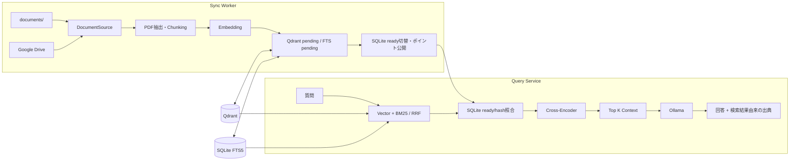

# RAGシステム設計書

## 1. 目的と概要

Windows上でローカルPDFおよび任意のGoogle Driveフォルダーを同期し、日本語の質問へ根拠付きで回答する。アプリ起動後、Sync Workerが文書を非同期に索引する。Query（質問）処理は同期とは独立し、旧ready索引がある間は同期中も検索を継続する。初回同期で検索可能な資料がまだなければ、完了まで質問を受け付けない。

回答はOllamaのLLMで生成し、QdrantとSQLite FTS5のHybrid Search、任意設定されたCross-Encoder Rerankerを使う。ファイル名・PDFページ・抜粋は検索結果から作り、Drive文書には元ファイルへのリンクを返す。

## 2. 前提と設計判断

| 項目 | 決定 |
|---|---|
| OS・Web | Windowsを主対象とする。Flaskは`127.0.0.1`のみで公開し、アプリは単一プロセスで起動する。 |
| 同期元 | `documents/`のPDFと、設定した場合のGoogle Driveフォルダー配下のPDF・Google Docs・Google Slides。Webアップロードは行わない。 |
| Drive認可 | `drive.readonly` OAuth scope。画面の接続操作だけがブラウザー認可を開始し、定期Workerは保存済みtokenのみ使う。 |
| PDF処理 | `pypdfium2`でページ単位抽出、ページ境界を維持したChunking。OCRは対象外。 |
| Embedding | `intfloat/multilingual-e5-base`。文書に`passage: `、質問に`query: `を付ける。 |
| Retrieval | QdrantのCosine Vector Search + SQLite FTS5 trigram/BM25をRRFで融合する。 |
| Reranker | 既定`BAAI/bge-reranker-v2-m3`。環境変数を空にすると無効化できる。 |
| 回答LLM | Ollama `gemma3:12b`。モデル名は設定可能。 |
| 永続化 | Qdrantは検索用ベクトル・チャンク、SQLiteは文書同期状態と変更token、別SQLite FTS5はキーワード索引。 |
| 同時利用 | Flaskの複数リクエストとSync Workerのスレッドを許可する。各共有モデル・Qdrant・SQLite接続は必要な操作単位でロックする。Qdrant Localを使う複数プロセスやCLI同時実行は禁止。 |

モデルの初回取得はネットワークが必要になる場合がある。実環境はPython `3.10.11`で確認し、起動・依存条件はREADMEに記録する。

## 3. アーキテクチャ

### 3.1 責務

| 層 | 責務 |
|---|---|
| `application/sync` | DocumentSourceを走査し、差分だけ解析・索引する。バックグラウンドWorkerは状態・進捗・失敗を提供する。 |
| `application/query` | Hybrid検索、同期状態照合、関連度棄却、Rerank、Context制限、LLM回答、参照ID検証を調整する。 |
| `domain` | DocumentRef、TextChunk、SyncStateEntry、回答型、アプリケーション例外を定義する。 |
| `ports` | Source、SyncState、VectorStore、KeywordIndex、Embedding、Reranker、ChatModelの契約を定義する。 |
| `infrastructure/sources` | ローカル文書とDriveのメタデータ列挙・取得・OAuthを実装する。 |
| `infrastructure/parsing` / `ml` | PDF抽出・Chunking・Embedding・Rerank・Ollamaを実装する。 |
| `infrastructure/storage` | Qdrant、SQLite FTS5、SQLite同期状態を実装する。 |
| `web` | 同期状態のポーリング、同期要求、Drive認可、質問APIと画面を提供する。 |

## 4. 同期設計

ローカル同期元はPDFの更新時刻とサイズ、Drive PDFはMD5、Google形式ファイルは更新日時をrevisionとして使う。DriveはChanges APIのpage tokenで変更の有無を先に確認し、変更があるときだけフォルダー階層のメタデータを再列挙する。各ファイルのrevisionが同じなら本文取得を省略し、変更ファイルだけSHA-256確認・Parse・Chunk・Embeddingを行う。

更新は旧版を壊さない。新版のベクトルとキーワード行を`pending`で登録し、同期管理SQLiteのready版を切り替えた後に公開する。失敗時はpendingを検索から除外したまま旧ready版を維持する。切替後に旧ポイントを削除する。削除は同期元一覧を完全に取得した場合だけ検出し、一時エラーやファイル単位失敗がある場合Drive checkpointを進めず再試行する。

画像PDF、破損PDF、暗号化PDF、権限・取得失敗はファイル単位で記録し、他ファイルの処理を続ける。同期結果と失敗一覧は画面から参照できる。変更がないDrive同期はChanges APIでフォルダー再走査を省略する。

## 5. 検索・回答設計

1. E5で質問をEmbeddingし、Qdrantのベクトル候補を取得する。
2. FTS5 trigram/BM25で日本語語幹・英数字の型番などを検索する。
3. Reciprocal Rank Fusionで順位を融合し、pendingポイントを候補から除く。
4. SQLiteのready状態、本文SHA-256、Embeddingモデル、相対パスが一致する候補だけを残す。
5. `MIN_RELEVANCE_SCORE`未満だけならOllamaを呼ばず固定の根拠不足回答を返す。
6. Cross-Encoderを設定している場合は候補を再順位付けし、既定5チャンク・最大Context文字数内でプロンプトへ渡す。
7. LLMの未知参照IDを除去する。回答と出典は検索結果のメタデータから作成し、Drive文書は検証済みIDから生成したURLを表示する。

資料内の命令は信頼できない引用データとして扱う。資料に根拠がない場合、LLMにも推測せず「資料から確認できません」と回答するよう指示する。

## 6. エラーとセキュリティ

- Qdrantの次元またはdistance不一致を自動修復・削除しない。全件再構築は`--confirm`が必要。
- 同期状態DBはWALモードとスレッドロックを使用する。`.env`、OAuth token、PDF原本、SQLite/QdrantデータをGitへ登録しない。
- Flaskはdebug/reloaderを無効化し、Hostをlocalhostに限定する。状態変更APIはJSONかつ同一Originからの要求に限定する。
- API・画面にスタックトレースや絶対パスを漏らさない。回答・出典本文はJavaScriptの`textContent`で描画する。
- モデル取得・Google Drive同期は外部通信を行う。質問・文書・Embedding・LLM推論はローカル処理する。

## 7. 対象外と受け入れ基準

OCR、Webアップロード、外部公開、複数ユーザー、サーバー会話履歴は対象外。最低20件の実文書評価でRecall@5 90%以上、誤出典なし、期待要点を満たす回答90%以上、根拠なし質問への断定0件を初期目標とする。評価未実施の文書に対する品質保証とはしない。
